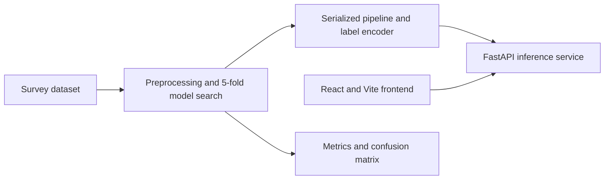

# Voter Intentions: KNN Pipeline and API

A machine-learning project that predicts a survey respondent's stated vote intention from structured profile and survey features.

> This is an educational model built from the repository's dataset. It is not an election forecast or a basis for real-world voter targeting or policy decisions.

## Overview

The repository contains a complete tabular ML workflow: preprocessing, cross-validated hyperparameter search, held-out evaluation, model serialization, and a FastAPI inference service. A React/Vite frontend and Docker Compose configuration provide a local end-to-end path from the UI to the model API.

## Key Features

- Custom handling of missing secondary-choice labels
- Numeric imputation and scaling plus categorical imputation and one-hot encoding
- K-nearest-neighbors model selection with stratified 5-fold grid search
- Persisted preprocessing/model pipeline and label encoder
- Per-class evaluation report and confusion matrix artifacts
- Pydantic-validated FastAPI endpoints for health and prediction
- React/Vite client and Docker Compose setup for local use

## Architecture



Preprocessing is part of the persisted scikit-learn pipeline, so the serving API applies the same transformations used during model fitting. The API validates the input schema before invoking the model.

## Tech Stack

- **Modeling:** Python, pandas, NumPy, scikit-learn, joblib
- **API:** FastAPI, Uvicorn, Pydantic
- **Frontend:** React, Vite
- **Packaging:** Docker, Docker Compose
- **Experiment assets:** Jupyter notebook, JSON/CSV reports, confusion-matrix image

## Project Structure

```text
src/                 Training pipeline and custom transformers
ml_service/          FastAPI prediction service
frontend/            React/Vite client
artifacts/           Serialized model bundle
reports/             Evaluation metrics and confusion matrix
notebooks/           Colab training notebook
docker-compose.yml   Local API and frontend orchestration
```

## Demo

A public hosted demo is not currently available. Run the API and frontend locally with Docker Compose, or start each service separately as described below. The bundled dataset and model artifacts are intended for demonstration and evaluation.

## Getting Started

### Prerequisites

- Python 3.11 recommended for the pinned dependency set
- Node.js and npm for running the frontend outside Docker
- Docker Desktop for the combined local setup

### Train the model

```bash
git clone https://github.com/EndDark16/voter_intentions.git
cd voter_intentions
python -m venv .venv
```

Activate the environment and install the pinned Python dependencies:

```powershell
# Windows PowerShell
.\.venv\Scripts\Activate.ps1
pip install -r requirements.txt
python src/train_knn.py
```

Training reads `voter_intentions_3000.csv`, performs a stratified 80/20 train/test split, tunes the KNN pipeline with 5-fold cross-validation, and writes the model bundle and evaluation artifacts.

### Run the API and frontend with Docker

The repository includes the model artifact expected by the API. From the project root:

```bash
docker compose up --build
```

- Frontend: `http://localhost:4173`
- API: `http://localhost:8000`
- Interactive API docs: `http://localhost:8000/docs`

### Run services separately

For the API, activate the Python environment above and set the module path:

```powershell
$env:PYTHONPATH = "src"
python -m uvicorn ml_service.app:app --reload --port 8000
```

For the frontend:

```bash
cd frontend
npm install
npm run dev
```

Vite uses its default development port unless configured otherwise. Set `VITE_API_URL` when the API is not reachable at the URL configured by the frontend.

## API

The FastAPI service exposes:

| Method | Path | Purpose |
|---|---|---|
| `GET` | `/health` | Service health check |
| `POST` | `/predict` | Predict an intended-vote label from the required survey feature schema |

The prediction response contains `intended_vote` and a `confidence_note`. KNN probabilities are not calibrated by this service; the response explicitly cautions against treating the result as a calibrated probability. The full request schema is in [`ml_service/app.py`](ml_service/app.py), and local interactive documentation is available at `/docs`.

## Machine Learning

The target is `intended_vote`. The pipeline handles 30 numeric features and two categorical choice features. Numeric values use iterative imputation and standardization; categorical values use most-frequent imputation and one-hot encoding. A custom transformer fills missing `secondary_choice` values. `GridSearchCV` evaluates KNN settings over five folds using macro-F1, then the selected pipeline is evaluated on a stratified 20% holdout.

## Results

These metrics are copied from the checked-in `reports/knn_metrics.json` artifact:

| Metric | Holdout score |
|---|---:|
| Accuracy | 0.7983 |
| Macro F1 | 0.2503 |
| Weighted F1 | 0.7522 |

Accuracy is substantially higher than macro-F1, so it should not be read as balanced performance across all classes. Review [`reports/knn_classification_report.json`](reports/knn_classification_report.json) and the confusion matrix before drawing conclusions.

## Testing and CI

The repository currently has no dedicated automated test suite or GitHub Actions workflow. Model evaluation is performed by the training pipeline and its held-out report artifacts.

## Engineering Decisions

- **Keep preprocessing with the estimator:** serializing the full scikit-learn pipeline reduces the risk of training/serving transformations drifting apart.
- **Tune for macro-F1:** the search objective values class-level balance rather than optimizing accuracy alone; the stored holdout metrics make the remaining gap visible.
- **Expose a narrow prediction contract:** Pydantic validates the request shape and the API returns a label plus a caveat instead of presenting an uncalibrated KNN score as probability.

## Future Improvements

- Add tests for preprocessing, model loading, schema validation, and API responses.
- Add CI checks for the training pipeline and container builds.
- Evaluate class-level performance and calibration before any non-educational use.
